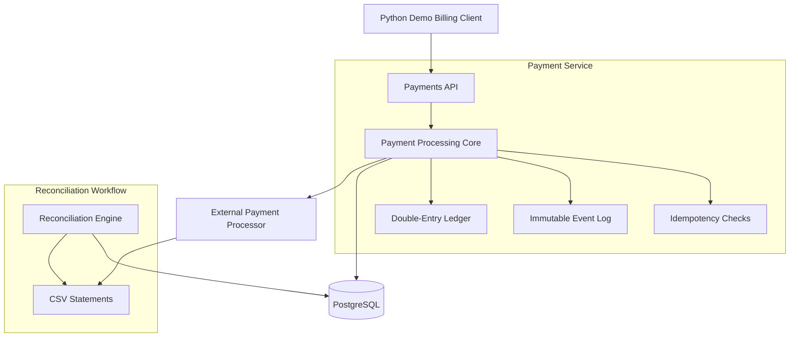

# Payments Microservice

This is a mock internal payments microservice for a fictional SaaS company built with Java and Spring Boot.

---

## Purpose

Coming from an accounting background, I used financial software every day for work, so I was curious to learn more about how these systems operate, which led me to create this project.

I chose to build a payments service specifically because I wanted to learn more about how large software companies make online purchases possible.

---

## Key Highlights

- **Idempotent Payment Processing**: Uses idempotency keys to prevent duplicate charges during retries.
- **Double-Entry Subledger**: Records each transaction as balanced debits and credits, preserving a zero-sum trial balance and a clear audit trail.
- **Immutable Audit Log**: Links business events, API requests, and financial postings in a traceable event history.
- **Automated Reconciliation Engine**: Reconciles internal records against external processor CSV statements and flags breaks such as amount mismatches or missing records.
- **CI/CD Pipeline**: Uses GitHub Actions to build and test the application with JUnit 5 and Testcontainers, with an ECS deployment workflow that can be enabled when needed.
- **Infrastructure Provisioned with Terraform**: Uses Terraform to provision and tear down the AWS infrastructure in a reproducible way.

---

## Architecture



---

## Tech Stack

- **Backend**: Java 17, Spring Boot 3, Spring Data JPA, Hibernate.
- **Database**: PostgreSQL with Flyway for versioned migrations.
- **Infrastructure**: Terraform, Docker, and AWS services including ECR, ECS, Fargate, and RDS.
- **Quality Assurance**: JUnit 5 and Mockito for unit testing, and Testcontainers full-lifecycle integration tests
- **Demo**: Python 3 with the `requests` library.

---

## Project Structure

- `app/`: Core Spring Boot application, including source code, tests, and the Dockerfile.
- `infra/`: Terraform IaC (`main.tf`), Docker Compose files, and local infrastructure config.
- `demos/`: Python demonstration script that walks through the API in action.
- `.github/workflows/`: GitHub Actions workflow definitions for automated testing and deployment.

---

## Demo Instructions

### 1. Set Up Environment Variables
```bash
cd infra
cp .env.demo.example .env
```

### 2. Start the Application & Database

Ensure you have Docker installed:

```bash
docker compose -f docker-compose.demo.yml up -d
```

### 3. Run the Demo

The demo script provides a narrated walkthrough of the payment lifecycle, idempotency, and reconciliation.

Ensure you have Python installed:

```bash
cd ../demos

python -m venv .venv
source venv/bin/activate
pip install -r requirements.txt

python PaymentServiceDemo.py
```

### Sample Demo Output

```text
--- DEMOING PAYMENT LIFECYCLE ---
Authorizing $100.00... Success! Payment ID: 550e8400-e29b...
Capturing $100.00... Success! Capture ID: 7c9e6679-7425...
Refunding $25.00...  Success! Refund ID: 1a2b3c4d-5e6f...

--- DEMOING DOUBLE-ENTRY SUBLEDGER ---
Cash Clearing balance: 75.00
Trial Balance: {'isBalanced': True, 'totalDebits': 125.00, 'totalCredits': 125.00}
```

---

## Design Decisions

### Ledger Model

I used a double-entry subledger instead of a single mutable `balance` column because payments systems need an auditable source of truth. Every financial event is recorded as balanced debits and credits, and the `GET /trial-balance` endpoint provides a quick way to check that the ledger is balanced.

### Scoped Idempotency

Idempotency keys are scoped to `(customer, action_type, key)` so the same client identifier can be reused across the payment lifecycle without causing duplicate side effects. That approach makes retries safer while still allowing `authorize`, `capture`, and `refund` to be treated as distinct operations.

### Reconciliation Workflow

I modeled reconciliation as a three-step workflow because it maps well to how payment operations are reviewed in practice:

1. **Import**: Load and validate external processor CSV data.
2. **Match**: Compare processor references and amounts against internal records.
3. **Review**: Summarize breaks that need manual investigation or automated follow-up.

---

## Infrastructure as Code (Terraform)

This project uses Terraform to manage infrastructure on AWS, which makes the environment reproducible, speeds up provisioning, and helps me control cloud costs.

### Managed Resources:

- **Networking**: Automated the creation of dedicated Security Groups for the application and database.
- **Database**: Amazon RDS instance running PostgreSQL, configured with security group rules to only allow ingress from the application layer.
- **Compute**: AWS ECS Cluster and Fargate Service for serverless container execution.
- **Observability**: CloudWatch Log Groups for centralized application logging.
- **Security**: IAM roles and policies for ECS task execution and ECR access.

---

## Future Extensions

### Payments & Lifecycle

- real processor integration with webhooks (`Stripe` test mode)
- idempotency key expiry and retry recovery for failed requests
- concurrency improvements (optimistic locking)
- chargebacks, disputes, and settlement-timing workflows
- authorization expiry, authorization voids, incremental authorizations, multi-capture flows, and partial captures

### Integrations & Automation

- mock processor service
- mock upstream billing service
- mock downstream ERP/general ledger integration
- self-healing scheduled reconciliation job
- outbox/event-driven architecture

### Platform & User Experience

- internal, finance-facing front-end UI
- JWT authentication

### Accounting & Settlement

- FX conversion, multi-currency settlement, and cross-border accounting complexity
- multi-entity accounting
